# Movie App

## 📌 Proje Genel Bakışı / Project Overview
Bu Flutter projesi, bir film keşfetme ve takip etme uygulamasıdır. Uygulama, modern bir kullanıcı arayüzü ile kimlik doğrulama, sonsuz kaydırmalı bir ana sayfa, kişiselleştirilmiş bir profil bölümü ve akıcı bir navigasyon sistemi sunmaktadır.

This Flutter project is a movie discovery and tracking application. It features a modern user interface with authentication, an infinite scrolling home page, a personalized profile section, and a smooth navigation system.

---

## 🏗️ Mimari ve Teknik Yapı / Architecture & Tech Stack

Bu proje, ölçeklenebilir, sürdürülebilir ve test edilebilir bir kod tabanı oluşturmak amacıyla modern yazılım mimarileri ve en iyi pratikler göz önünde bulundurularak geliştirilmiştir. / This project was developed considering modern software architectures and best practices to create a scalable, maintainable, and testable codebase.

- **Clean Architecture:** Proje, sorumlulukların ayrılması prensibine dayanarak katmanlı bir mimari (Domain, Data, Presentation) kullanır. Bu, iş mantığının UI ve veri kaynaklarından bağımsız olmasını sağlar. / The project uses a layered architecture (Domain, Data, Presentation) based on the principle of separation of concerns. This ensures that business logic is independent of the UI and data sources.
- **MVVM (Model-View-ViewModel):** Sunum katmanında (Presentation Layer), UI mantığını ve state yönetimini ayırmak için MVVM tasarım deseni benimsenmiştir. / In the presentation layer, the MVVM design pattern is adopted to separate UI logic from state management.
- **BLoC State Management:** Uygulama genelinde state yönetimi için `flutter_bloc` paketi kullanılmıştır. BLoC, olay tabanlı (event-based) yapısıyla öngörülebilir ve yönetilebilir bir state akışı sağlar. / The `flutter_bloc` package is used for state management throughout the application. With its event-based structure, BLoC provides a predictable and manageable state flow.

---

## 📱 Temel Gereksinimler / Core Requirements

### 1. Kimlik Doğrulama / Authentication
- Kullanıcı girişi ve kayıt işlevselliği. / User login and registration functionality.
- Oturum token'ının güvenli bir şekilde saklanması. / Secure storage of the session token.
- Başarılı girişte otomatik olarak ana sayfaya yönlendirme. / Automatic redirection to the home page upon successful login.

| Giriş Ekranı / Login Screen | Kayıt Ekranı / Register Screen |
|:---:|:---:|
| 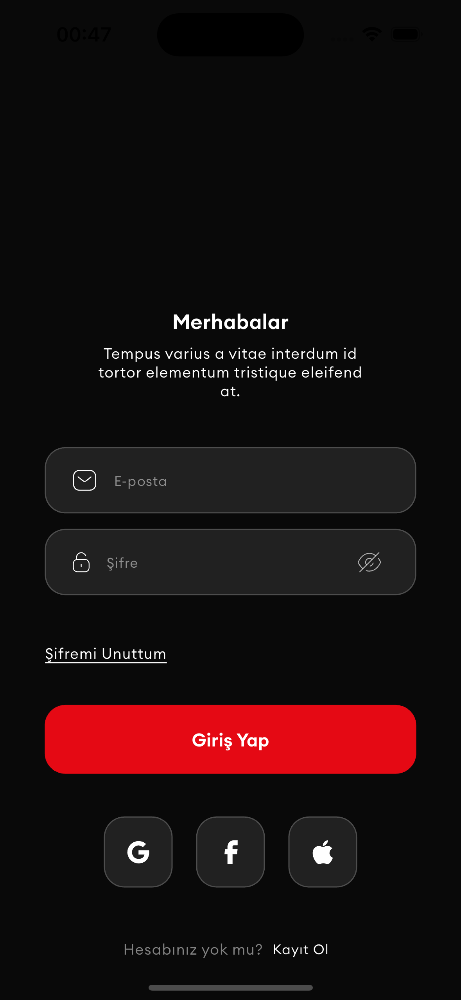 | 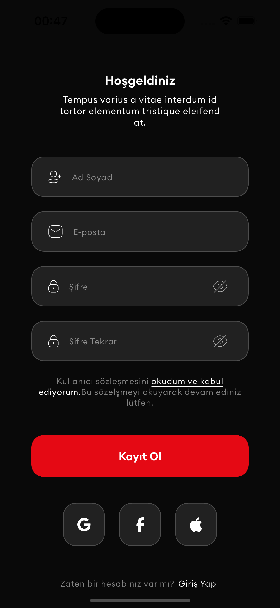 |

### 2. Ana Sayfa Özellikleri / Home Page Features
- Sonsuz kaydırma (Infinite scroll) ile filmlerin dinamik olarak yüklenmesi. / Dynamic loading of movies with infinite scroll.
- Her sayfada 5 film gösterimi. / Displaying 5 movies per page.
- Otomatik yükleme göstergesi. / Automatic loading indicator.
- Aşağı çekerek yenileme (Pull-to-refresh) özelliği. / Pull-to-refresh functionality.
- Favori film ekleme/çıkarma işlemlerinde anlık UI güncellemesi. / Real-time UI updates for favoriting/unfavoriting movies.

| Ana Sayfa / Home Page | Sonsuz Kaydırma / Infinite Scroll |
|:---:|:---:|
|  | 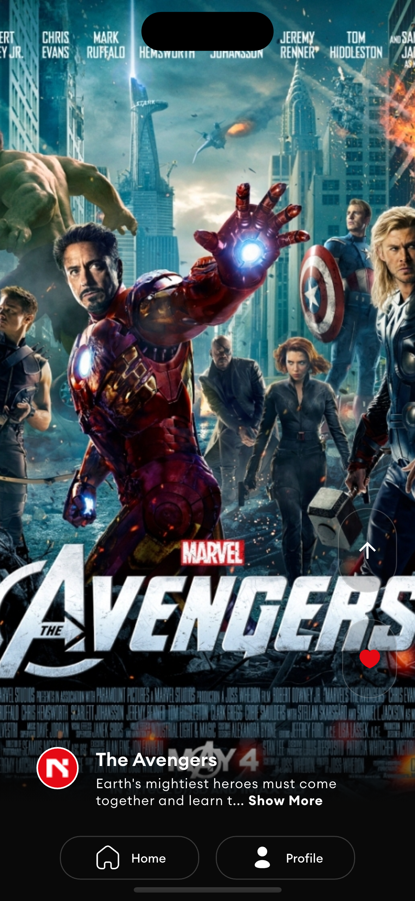 |

### 3. Profil Özellikleri / Profile Features
- Kullanıcı bilgilerinin (isim, ID) görüntülenmesi. / Display of user information (name, ID).
- Kullanıcının favori filmlerinin listelenmesi. / Listing the user's favorite movies.
- Profil fotoğrafı yükleme ve değiştirme özelliği. / Functionality to upload and change the profile picture.

| Profil Sayfası / Profile Page | Favori Filmler / Favorite Movies |
|:---:|:---:|
| 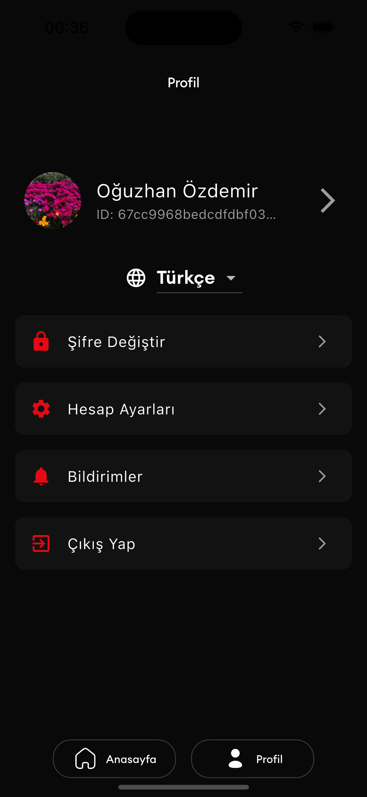 | 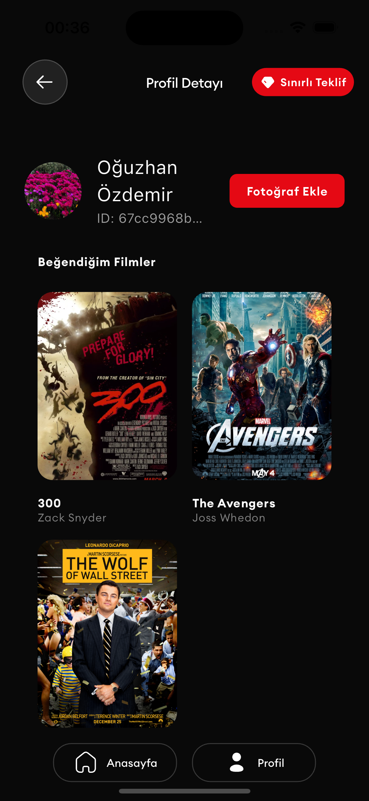 |

### 4. Navigasyon / Navigation
- `BottomNavigationBar` ile ana sayfalar (Anasayfa, Profil) arasında kolay geçiş. / Easy transition between main pages (Home, Profile) with a `BottomNavigationBar`.
- Sayfa geçişlerinde ana sayfa state'inin korunması. / Preservation of the home page state during page transitions.

### 5. Sınırlı Teklif Bottom Sheet / Limited Offer Bottom Sheet
- Özel tasarım bottom sheet uygulaması. / Custom bottom sheet implementation for limited-time offers.

| Bottom Sheet |
|:---:|
| 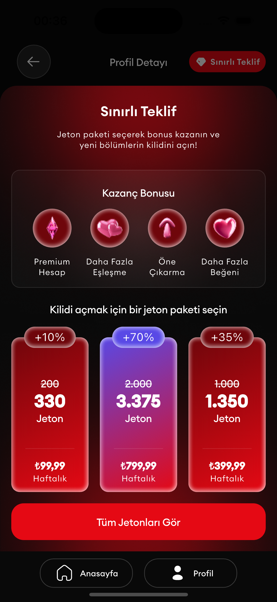 |

---

## 🎯 Ek Özellikler ve Servisler / Additional Features & Services

- **Özel Tema / Custom Theme:** Uygulama genelinde tutarlı bir görünüm için aydınlık ve karanlık modları destekleyen özel tema yapısı. / Custom theme structure supporting light and dark modes for a consistent look and feel across the app.

| Aydınlık Mod / Light Mode | Karanlık Mod / Dark Mode |
|:---:|:---:|
| 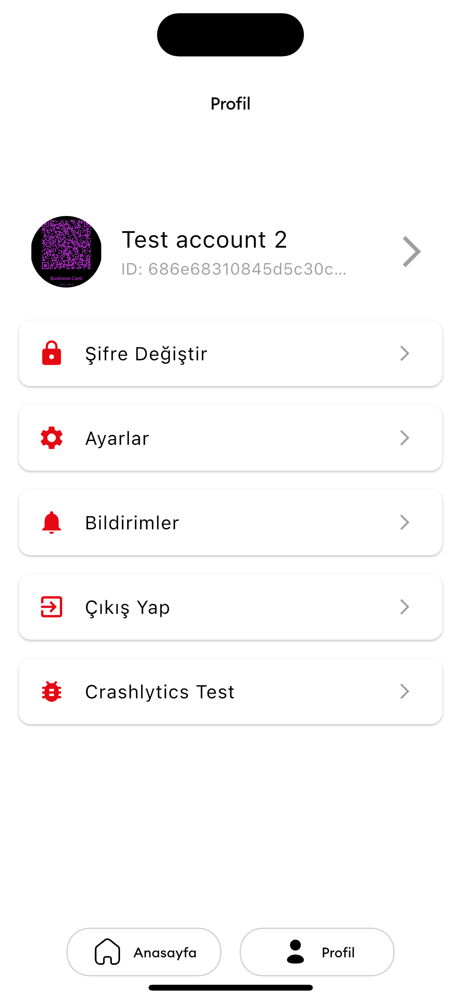 |  |

- **Navigasyon Servisi / Navigation Service:** Sayfa yönlendirmeleri için `auto_route` paketi kullanılarak bildirimsel (declarative) ve tip güvenli (type-safe) bir yönlendirme hizmeti oluşturulmuştur. / A declarative and type-safe routing service has been created using the `auto_route` package for page navigation.

- **Lokalizasyon Servisi / Localization Service:** `easy_localization` paketi ile çoklu dil desteği (Türkçe, İngilizce) sağlanmıştır. / Multi-language support (Turkish, English) is provided with the `easy_localization` package.

| Türkçe / Turkish | İngilizce / English |
|:---:|:---:|
| 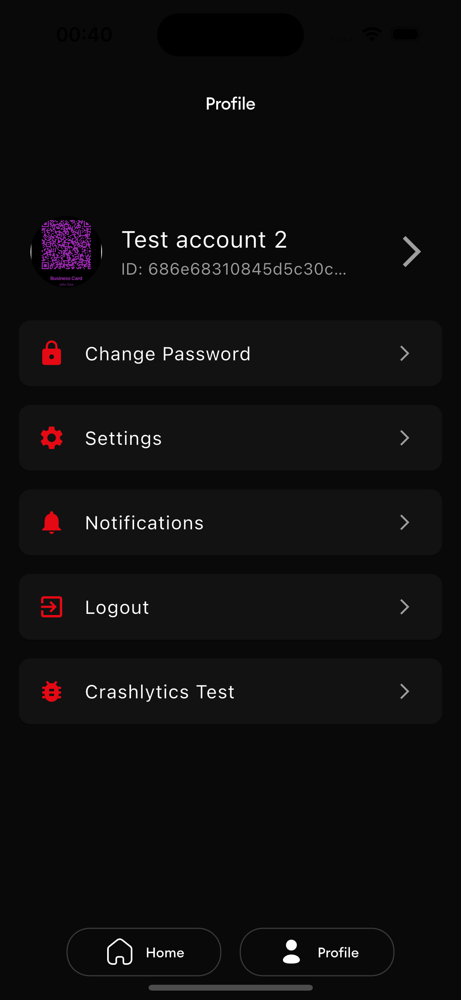 | 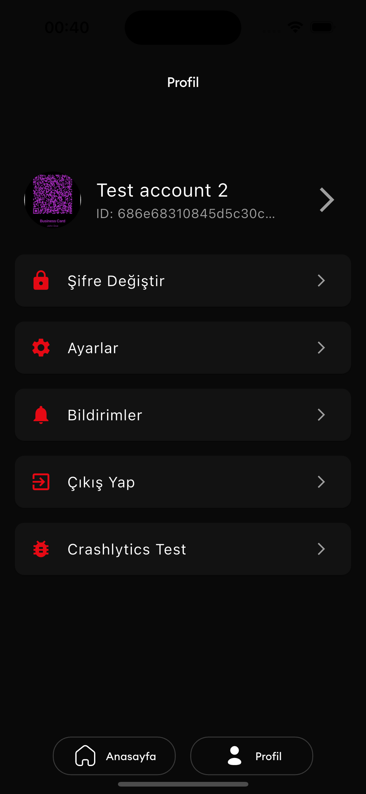 |

- **Logger Servisi / Logger Service:** Hata ayıklama ve olay takibi için yapılandırılmış bir `Logger` servisi bulunmaktadır. Uygulama içi log ekranı da mevcuttur. / There is a configured `Logger` service for debugging and event tracking. An in-app logger screen is also available.

| Logger Ekranı / Logger Screen |
|:---:|
| 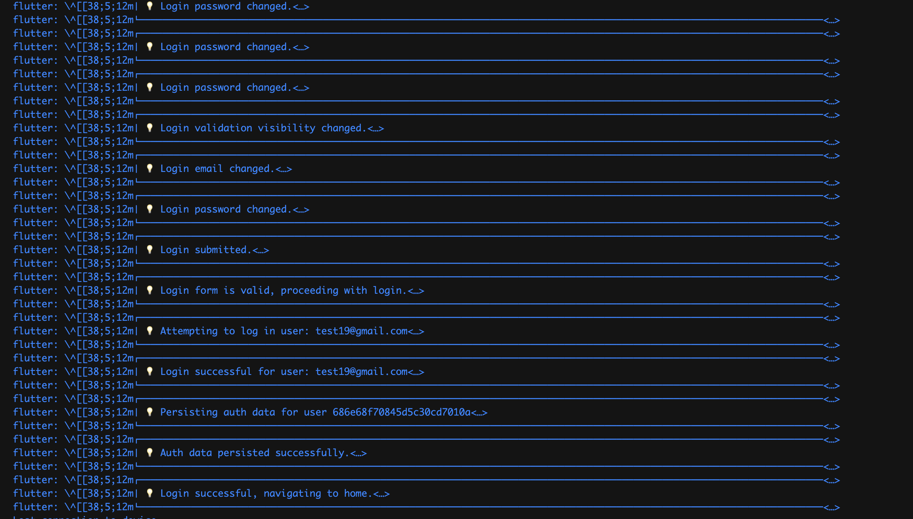 |

- **Firebase Entegrasyonları / Firebase Integrations:**
  - **Crashlytics:** Uygulama çökmelerini raporlamak için entegre edilmiştir. / Integrated to report application crashes.
  - **Analytics:** Kullanıcı etkileşimlerini izlemek için temel düzeyde entegrasyon yapılmıştır. / Basic integration for tracking user interactions.

| Firebase Analytics |
|:---:|
| 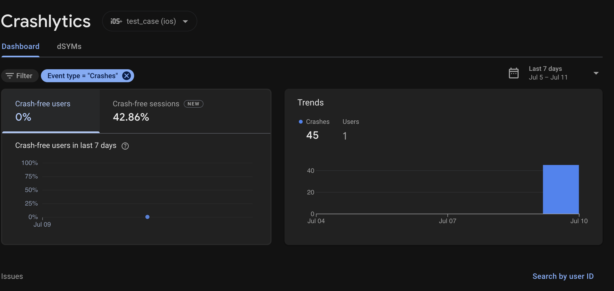 |

- **Animasyonlar / Animations:** Kullanıcı deneyimini zenginleştirmek için `Lottie` animasyonları (yükleme, boş sayfa vb.) kullanılmıştır. / `Lottie` animations (loading, empty page, etc.) have been used to enrich the user experience.

| Yükleme Animasyonu / Loading Animation | Boş Sayfa Animasyonu / Empty Page Animation |
|:---:|:---:|
| 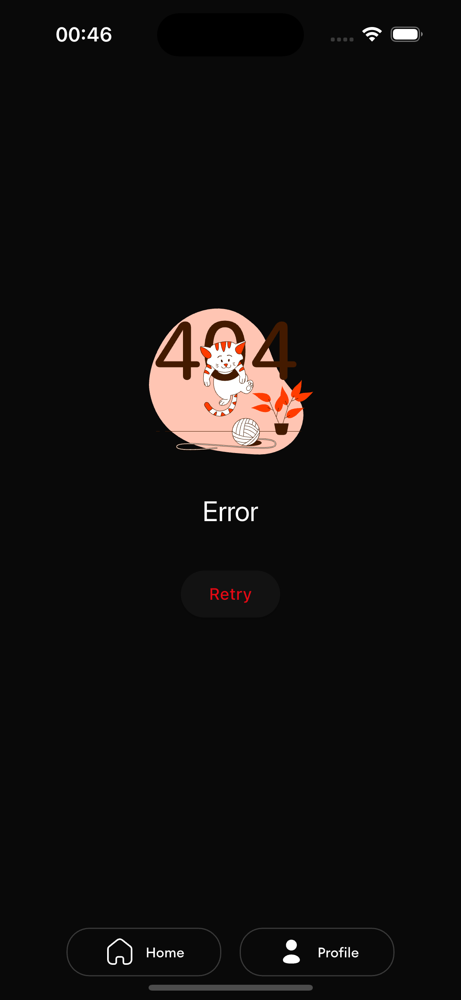 | 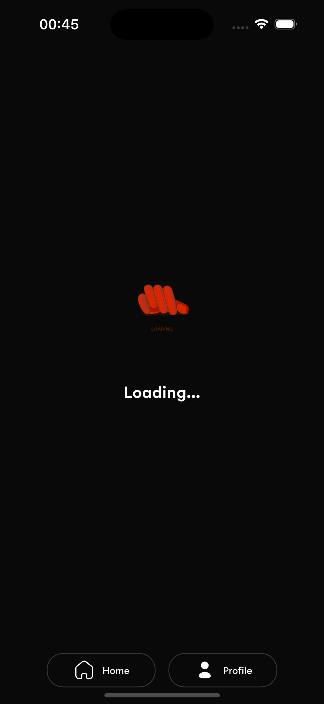 |

- **Güvenli Token Yönetimi / Secure Token Management:** Oturum token'ları `flutter_secure_storage` kullanılarak cihazda güvenli bir şekilde saklanmaktadır. / Session tokens are securely stored on the device using `flutter_secure_storage`.

- **Splash Screen & Uygulama İkonu / Splash Screen & App Icon:** Uygulamanın marka kimliğini yansıtan özel bir açılış ekranı ve uygulama ikonu eklenmiştir. / A custom splash screen and app icon that reflect the app's brand identity have been added.

| Splash Screen | Uygulama İkonu / App Icon |
|:---:|:---:|
| 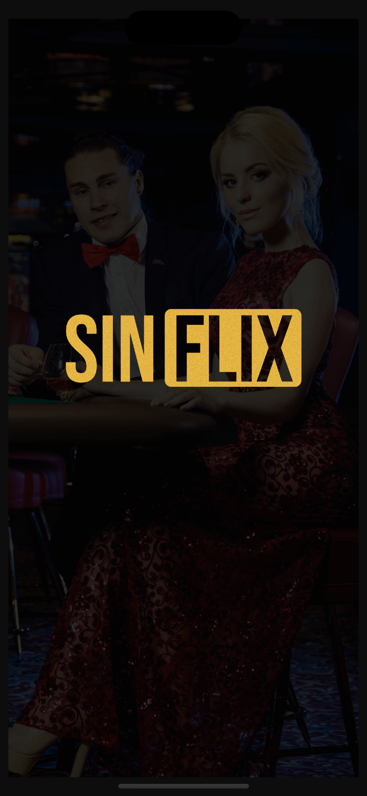 | 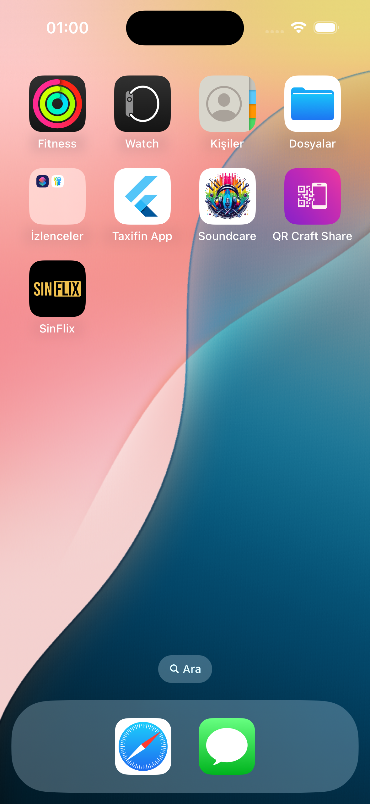 |

---

### 6. Film Detay Sayfası / Movie Detail Page
- Film detaylarının gösterimi. / Display of movie details.

| Film Detay Sayfası 1 / Movie Detail Page 1 | Film Detay Sayfası 2 / Movie Detail Page 2 |
|:---:|:---:|
| 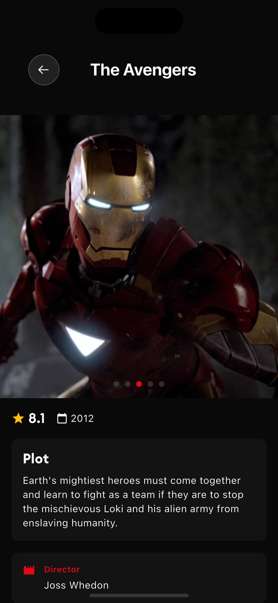 | 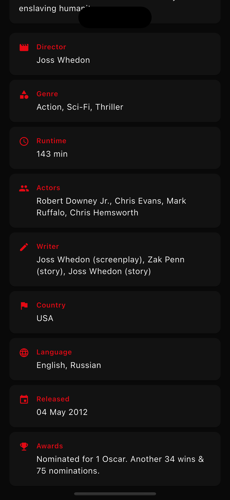 |

---

## 🚀 Kurulum & Çalıştırma / Installation & Setup
1. **Depoyu Klonlayın / Clone the Repository:**
   ```sh
   git clone https://github.com/ozdemiroguz/test_case.git
   ```
2. **Proje Klasörüne Girin / Navigate to the Project Folder:**
   ```sh
   cd test_case
   ```
3. **Bağımlılıkları Yükleyin / Install Dependencies:**
   ```sh
   flutter pub get
   ```
4. **Kod Üretimini Çalıştırın / Run Code Generation:**
   ```sh
   flutter pub run build_runner build --delete-conflicting-outputs
   ```
5. **Uygulamayı Çalıştırın / Run the App:**
   ```sh
   flutter run
   ```

---

## 📜 Lisans / License
Bu proje açık kaynaklıdır ve özgürce değiştirilebilir. / This project is open-source and available for modification.

---

## 📧 İletişim / Contact
Herhangi bir sorunuz için [GitHub Issues](https://github.com/ozdemiroguz/test_case/issues) üzerinden ulaşabilirsiniz. / For any questions, feel free to reach out via [GitHub Issues](https://github.com/ozdemiroguz/test_case/issues).
